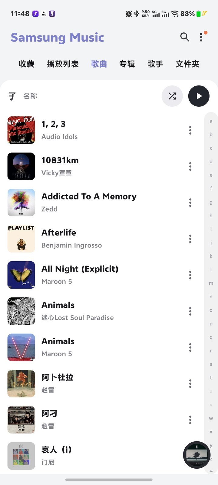
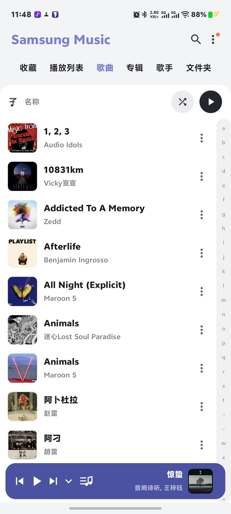
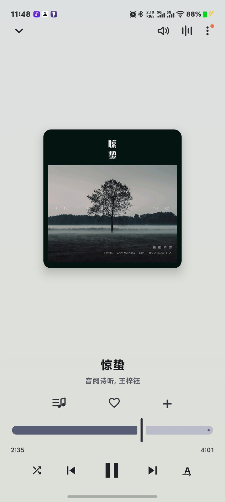
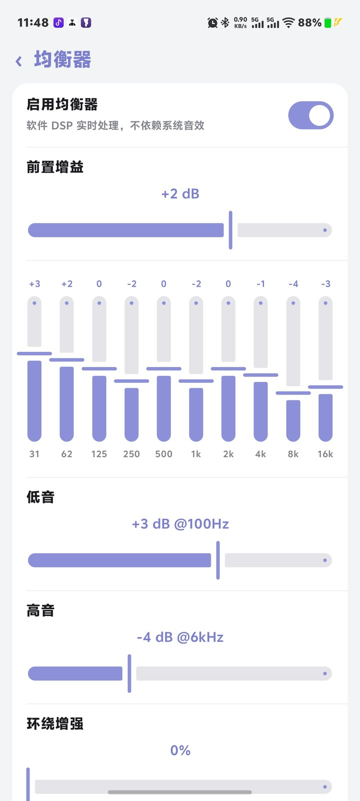
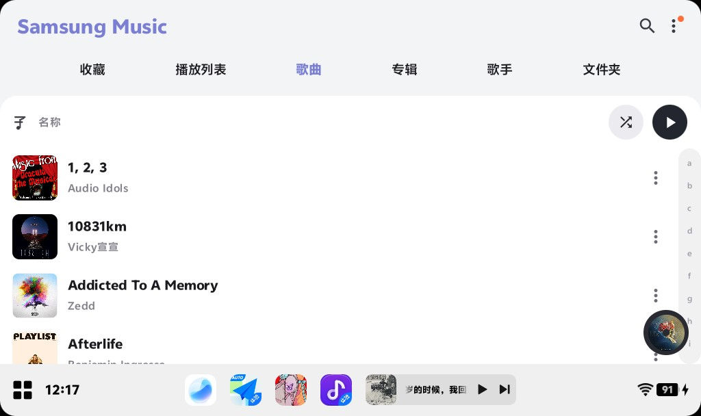
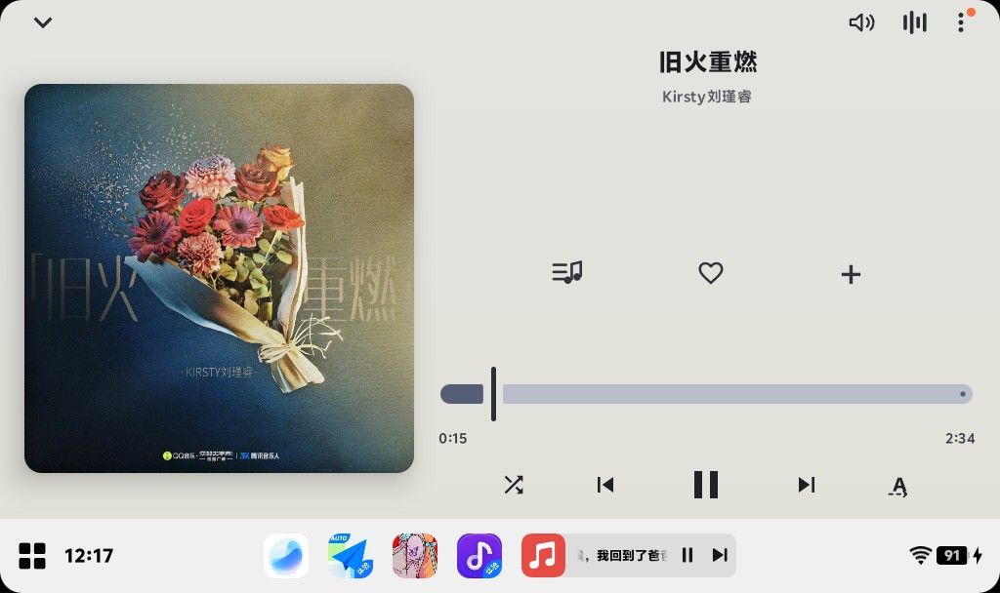
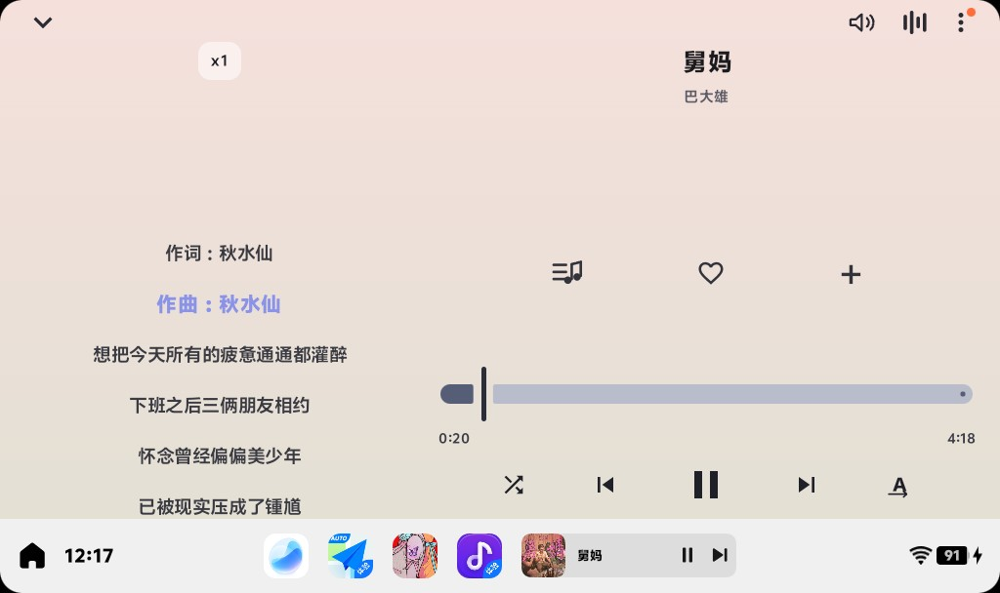
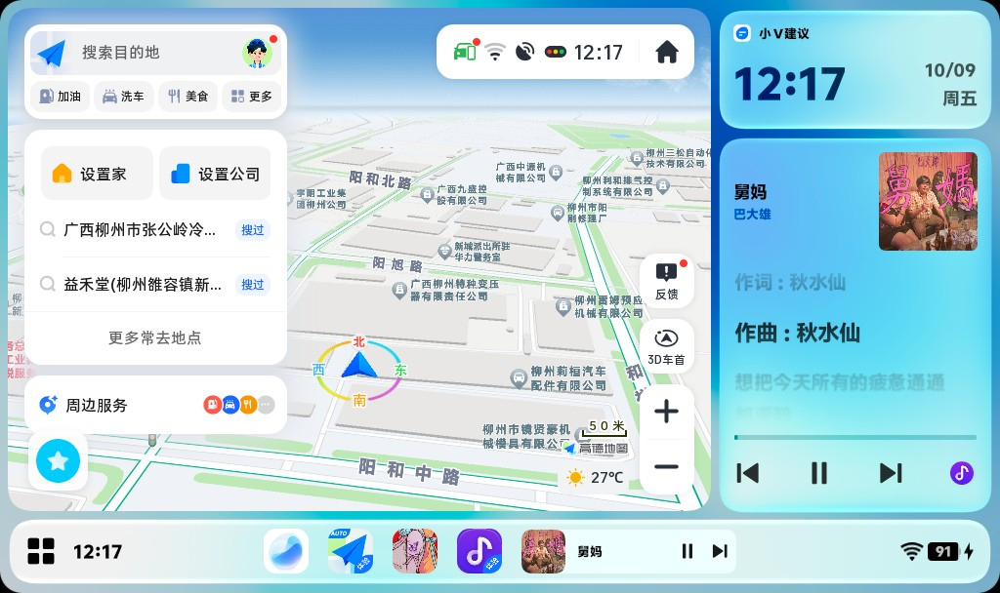

# Samsung Music (RC)

> 一个仿 Samsung Music 界面风格的**本地音乐播放器**。纯本地曲库，不联网、不充值、无会员，
> 你的 FLAC / WAV / DSD 转码文件就该跑在一条干净的输出链路上。
>
> Compose + Media3 + Room，外加一层 **Oboe 原生输出**（AAudio / USB DAC 独占）与**软件 EQ**；
> 并且完整适配了 **vivo 车机 / JoviInCar 原子随身听**的歌词投屏。

- 最低系统：Android 8.0（API 26）｜目标：Android 15（API 35）｜ABI：arm64-v8a
- 语言：简体中文 / English 跟随系统
- 包名：`com.spotify.music`（车机与部分系统音乐入口按包名识别，故沿用；与官方 Samsung Music 无关）

---

## 为什么做这个

手机自带的音乐播放器要么在推流媒体会员，要么把本地文件当成二等公民：封面糊、歌词不准、
输出被系统重采样、车机上只显示一行歌词。这个项目想要的东西很朴素——

**一个能安静放本地歌、音质链路可控、上车就能显示歌词的播放器。**

界面致敬 Samsung Music（One UI 那套紫色强调色、底部迷你条展开成整页、黑胶唱片动效），
实现全部重写，功能按自己的需求往前多做了一步。

---

## 特性一览

### 曲库

- 收藏 / 播放列表 / 歌曲 / 专辑 / 歌手 / 文件夹 六大标签，标签顺序与显隐可自定义
- 支持 MP3 / FLAC / M4A / AAC / WAV / OGG / Opus / WMA / AMR / AIFF / APE
- 自定义扫描目录、手动"立即扫描"、回前台自动增量检测，无需系统媒体库授权
- 隐藏文件夹、按名称/艺术家/专辑/时长/添加时间排序、右侧 A–Z 索引气泡快速跳转
- 中英文混排按拼音排序，搜索覆盖歌曲 / 专辑 / 艺术家 / 文件夹

### 播放

- Media3 ExoPlayer + 前台服务，锁屏与通知栏播控，耳机线控
- 底部迷你播放条 ↔ 全屏播放页连续形变（封面收成黑胶唱片、播控与歌词一起位移）
- 播放队列：随机、单曲/列表循环、**淡入淡出（Crossfade）**、**跳过静音段**、**倍速播放**、睡眠定时器
- 队列规则可配：是否允许重复、是否仅播放当前列表
- 与其他应用同时播放、息屏继续播放、允许外部设备（车机/蓝牙）发起播放
- 长标题自动跑马灯，冷启动恢复上次队列与进度（保持暂停，不抢焦点）
- 加入队列 / 下一首播放、收藏、新建与编辑歌单、分享、设为铃声、删除文件

### 音质与输出

- **三种输出后端**：系统 AudioTrack / Oboe AAudio / Oboe OpenSL ES，可切换对比
- **USB DAC 独占模式**（AAudio）：支持采样率、位深、声道数直出，插拔自动路由与热切换
- 输出设备可选：扬声器 / 有线耳机 / 蓝牙 / USB 音频设备 / 听筒
- 实时显示当前真实输出参数（设备、模式、采样率、位深、声道），不玩"看起来开了"
- 采样率支持"跟随音源"或固定；位深支持 16 / 24 / 32 / Float
- **软件 EQ 全链路**：10 段双二阶（RBJ Peaking）+ 前置增益 + 低音搁架 + 高音 + 环绕增强 + 总增益，
  配软限幅防削波；不依赖系统音效，换手机、接 DAC 表现一致
- 预设：平直 / 流行 / 摇滚 / 爵士 / 古典 / 电子 / 人声

### 歌词

- 同名 `.lrc` / `.txt` 侧挂文件优先，其次读内嵌标签：MP3 ID3v2 `USLT`、FLAC Vorbis Comment
  `LYRICS`/`UNSYNCEDLYRICS`、M4A `©lyr`
- LRC 解析支持 `[mm:ss]` / `[mm:ss.xx]` / `[mm:ss.xxx]`、一行多时间戳、`[h:mm:ss]` 变体、
  元信息标签与 `offset`、增强型逐字时间戳自动剥离
- 编码嗅探：UTF-8 / UTF-16LE / UTF-16BE / GBK 都能认，带 BOM 自动跳过
- 有时间戳逐行跟随进度滚动，无时间戳静态显示；播放页与歌词页均可用

### 车机 / 系统适配

- **vivo 车机 / JoviInCar 原子随身听**深度适配（详见下一节）
- 横屏与方屏自适应：按长宽比自动切换车机双栏布局，1024×608、880×860 一类近方屏单独调过
- 高刷新率请求、全页面滑动返回（边缘手势 + 系统预测返回）
- 内置崩溃与诊断日志，便于定位"某台机器不响"这类问题

---

## 截图

### 手机端

<table>
<tr>
<td align="center"><br>曲库列表</td>
<td align="center"><br>迷你播放条</td>
</tr>
<tr>
<td align="center"><br>全屏播放页</td>
<td align="center"><br>均衡器</td>
</tr>
</table>

左侧 A–Z 索引、顶部标签栏可自定义显隐；底部圆形封面即迷你播放条，点按展开为整页播放器。
均衡器页为 10 段 + 前置增益 + 低音/高音/环绕增强，下方为预设列表。

### 车载投屏（vivo 车机 / JoviInCar）

<table>
<tr><td align="center"><br>车机曲库（横屏双栏）</td></tr>
<tr><td align="center"><br>车机播放页</td></tr>
<tr><td align="center"><br>车机歌词页</td></tr>
<tr><td align="center"><br>vivo 桌面原子组件</td></tr>
</table>

横屏车机自动切换为双栏布局（左信息 / 右歌词），底部保留 Dock 播控条。

最右那张是 **vivo 手机桌面（OriginOS 系统界面）** 上的"小V建议 · 音乐原子组件"卡片，不是车机界面：
车机版通过 JoviInCar 协议把播放状态注册到系统，OriginOS 便在手机桌面上渲染这张卡片 —— 封面、曲名、
作词作曲与滚动歌词一并呈现，进度条跟着实际播放走。

---

## 关于 vivo 原子通知 / JoviInCar 的适配

这是本项目最"不体面"但最有用的一部分——车机生态没有公开文档，只能靠抓包和试错对齐。
如果你也在做安卓音乐 App 上 vivo 车机，这段可以省你几天。

### 1. 暴露给车机的服务

车机侧（原子随身听 / JoviInCar）不是"读通知栏"，而是通过 `MediaBrowserService` 连接播放器，
所以要显式声明它能识别的 action：

```xml
<service android:name=".playback.PlaybackService" android:exported="true">
    <intent-filter>
        <action android:name="android.media.browse.MediaBrowserService" />
        <action android:name="androidx.media3.session.MediaSessionService" />
    </intent-filter>
    <!-- vivo 车机 / JoviInCar 原子随身听入口 -->
    <intent-filter>
        <action android:name="com.vivo.musicwidgetmix.support.service" />
    </intent-filter>
</service>
```

会话用 `MediaLibrarySession`（不是普通 `MediaSession`）构建，并通过 `setSessionActivity()` 挂一个
指向播放页的 `PendingIntent`——车机卡片点击跳转、以及手机侧 `MediaSessionManager.getActiveSessions()`
发现本应用，都依赖这一项；服务同时声明 `foregroundServiceType="mediaPlayback"` 保证息屏后不被杀。

### 2. 播放列表必须"可播放"

给车机浏览树返回的每个 `MediaItem` 都要显式 `setIsPlayable(true)`，
并且 `onGetChildren` 的根节点要返回真实歌曲。vivo 侧拿到 `isPlayable=false` 的条目
会直接跳过或崩溃——列表里"只有专辑没有歌"通常就是这个原因。

### 3. 歌词走两条通道，同时喂

车机型号和系统版本不一，歌词通道有两套，本项目**同时发送**，谁支持谁生效：

| 通道 | 载体 | 语义 |
| :--- | :--- | :--- |
| `ucar`（车机媒体框架） | `MediaMetadata.extras` | 一次给**整段 LRC**，车机按进度自己滚动 |
| `vivomusicmix`（原子随身听） | `setSessionExtras()` 事件 | 逐行推送当前歌词行 |

对应字段名：

```text
ucar.media.metadata.LYRICS_WHOLE     整段 LRC
ucar.media.metadata.LYRICS_STATUS    固定 0（有歌词）
vivomusicmix.extra.lrc_change        歌词变更事件
```

踩过的坑，都写进了注释：

- `LYRICS_STATUS` 只能给 `0`。**负值会被车机判定为"本曲无歌词"**，整首歌的歌词位直接消失。
- **绝对不要写 `ucar.media.metadata.LYRICS_LINE`**：一旦存在，车机改走"逐行模式"，
  而它拿不到持续更新的行，结果是卡片永远停在第一行或空白。
- `LYRICS_WHOLE` 必须是**规范 LRC**：一行一个时间戳、去掉增强型逐字标签 `<mm:ss.xx>`。
  多时间戳行和逐字标签会让车机解析器整段丢弃。
- 切歌时要**先发空歌词再发新歌词**，否则上一首的词会残留在新歌开头。
- 原子随身听有事件合并/丢弃逻辑，所以带 `lrc_change` 的 extras 要**每 25 秒重发一次**兜底，
  否则停车怠速、界面重绘之后歌词就不再更新了。
- vivo 的扩展字段存在官方拼写错误（`meida` / `meidia`），**照抄，不要"顺手纠正"**，
  纠正之后字段就读不到了。

### 4. 让车机能"唤起"播放，但要防误触

车机点卡片播放按钮时，往往是在**没有 Activity** 的情况下通过 `MediaController` 下发
`COMMAND_PLAY_PAUSE`。本项目在 `onPlayerCommandRequest` 里区分"应用内"与"外部控制器"两种来源，
并做了两件事：

- **外部启动开关**：设置里的「允许外部设备开始播放」关闭时，外部控制器在**队列为空**的情况下
  无法启动播放（避免上车蓝牙一连、音乐自己响了）；队列已有内容时仍然放行。
- **暂停保护窗口**：刚在手机上手动暂停过，紧接着车机又发来一个 PLAY，会被判定为误触并丢弃
  （`RESULT_INFO_SKIPPED`），不会出现"我刚按停它又自己响了"。

另外，服务 `onCreate` 会 `restoreLastQueue()` 恢复上次的队列与进度（**恢复为暂停态，不抢音频焦点**），
这样车机连上时浏览树里始终有内容可显示，而不是一个空白会话。

### 5. 界面侧

车机分辨率千奇百怪，本项目按**长宽比**而非"是否车机"判定布局：比例 > 1.2 走双栏，
1024×608、880×860 这类近方屏单独收紧间距，避免标题压到 Dock。

> 以上适配默认开启，可在「设置 → 播放与音效 → 车载投屏歌词」关闭。
> 关闭后不再向车机推送歌词，其余播控不受影响。

---

## 构建

```bash
# JDK 17 + Android SDK（platform 35/36、build-tools、NDK 27.2.12479018、CMake 3.22.1）
gradle :app:assembleRelease --no-daemon --no-configuration-cache
# 产物：app/build/outputs/apk/release/app-release-unsigned.apk
```

仓库不含 `gradlew`，请用本地 Gradle 8.9（CI 同版本）。原生库 `liboboe_sink.so` 由
`app/src/main/cpp` 经 CMake 随构建自动编译，无需手工准备。

签名：

```bash
zipalign -p -f 4 in.apk aligned.apk
apksigner sign --ks your.jks --ks-key-alias youralias aligned.apk
```

> 提示：AGP 直接产出的包若再经 `sign-apk` 之类的二次封装脚本处理，个别版本会破坏 v3 签名块，
> 建议 zipalign + apksigner 直签。

CI：`.github/workflows/build.yml` 每次 push 构建 Release APK 并上传为构建产物。

## 下载

Releases 页提供已签名的 APK：
<https://github.com/7tattoo/SamsungMusicRC/releases>

## 技术栈

| 组件 | 用途 |
| :--- | :--- |
| Kotlin 2.0 + Jetpack Compose (Material 3) | 全部界面 |
| AndroidX Media3 (ExoPlayer) 1.11 | 播放内核、通知与锁屏、车机会话 |
| Room 2.6 (SQLite) | 曲库、歌单、收藏、播放历史 |
| [Oboe](https://github.com/google/oboe) 1.9 (C++/JNI) | AAudio / OpenSL ES 输出与 USB DAC 独占 |
| Coil 2.7 | 封面加载与内存缓存 |
| ICU4J | 中文拼音排序 |

纯 Kotlin + 一层 C++，无 Retrofit/无埋点/无广告；清单里**没有 `INTERNET` 权限**，
抓包可以看到它一个字节都不往外发。

## 关于包名

包名为 `com.spotify.music`：vivo 车机与部分系统音乐入口按**已知音乐包名白名单**识别投屏对象，
落在白名单内才能稳定唤起原子随身听卡片。若你希望与其他音乐 App 共存，
可修改 `app/build.gradle` 里的 `applicationId`（`namespace` 保持不变即可，代码、资源与 JNI 绑定都不用动，
`FileProvider` 与 startup 的 authority 会自动跟随），但改完后车机侧识别需要重新验证。

## 来源与感谢

- 生产力 · **Minis** — https://github.com/OpenMinis
- UI · **Samsung** — https://www.samsung.com.cn/
- 音效 · **Halcyon** — https://github.com/Kifranei/Halcyon
- 作者 · **鬼蓝** — https://b23.tv/jqYmSVw

- **Minis**：全部代码编写、调试与打包在 Minis 中完成。
- **Samsung**：界面与交互（标签栏、迷你播放条 ↔ 黑胶唱片形变、均衡器版式）参考 Samsung Music。
- **Halcyon**：原生 Oboe 输出后端（`app/src/main/cpp/oboe_sink.cpp`）与软件 EQ 的思路源自 Halcyon /
  RawS Music（Apache-2.0），本项目为独立 Kotlin/C++ 实现，版式亦对齐 Halcyon 的音效设置结构。

## 许可与声明

- 本项目为**非官方**爱好者作品，与三星电子无隶属或授权关系。"Samsung" / "Samsung Music" 为三星电子商标，
  本项目仅作界面设计参考。
- 仓库当前**未附带 LICENSE 文件**，在法律上默认"保留所有权利"。源码公开仅供学习参考，
  未经许可请勿二次分发或用于商业用途；如需明确授权，请联系作者补充许可证。
- 项目仅供学习交流，请勿用于任何商业用途；因使用本软件造成的数据丢失、设备异常或流量费用，作者不承担责任。
- 你播放的音乐文件版权归各自权利人所有，请自行确保使用权。

---

如果它在你的车上、在你的 USB DAC 上正常出声了，欢迎开个 issue 说一声；
不能出声的机型更欢迎来报——这类"我这台不行"的问题最有价值。

